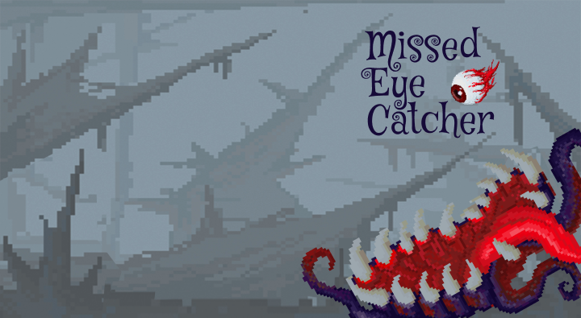

# 🎮 Missed Eye Catcher



A fun arcade-style Java Swing game where you catch falling shapes with your monster paddle! Test your reflexes as shapes fall faster with each level. Catch hearts for extra lives and larger shapes for bonus points!

## ✨ Features

- **Dynamic Gameplay**: Falling shapes with increasing speed as you level up
- **Special Items**: 
  - ❤️ Heart drops every 15th spawn grant extra lives
  - ⭐ Large shapes (every 10th spawn) give double points
- **Smooth Controls**: Mouse-controlled paddle with smooth following
- **Rich Audio**: Background music, sound effects, and ambient voices
- **Animated Background**: Moving starfield that speeds up with your level
- **Visual Effects**: Color flashes on catch/miss, rotating shapes
- **Score System**: Track your high score across sessions

## 🚀 Quick Start

### Prerequisites
- Java Development Kit (JDK) 8 or higher
- Windows PowerShell (or any terminal with Java)

### Run the Game

```powershell
javac MissedEyeCatcher.java
java MissedEyeCatcher
```

### Game Assets
The game uses optional assets from the `assets/` folder:
- **Images**: `BackGround.png`, `StartBackGround.png`, `fireball.png`, `heart.png`, `game_over.png`, `monster.gif`
- **Sounds**: `start.wav`, `game.wav`, `eating1.wav`, `eating2.wav`, `miss.wav`, `lose-heart.wav`, `gameover.wav`, `roar-echo.wav`, `monster-growl.wav`

If assets are missing, the game will use vector graphics and run silently.

## 🎯 How to Play

1. **Enter your name** on the welcome screen
2. **Click "Start Game"** to begin
3. **Move your mouse** to control the monster paddle
4. **Catch falling shapes** to score points:
   - Regular shapes: **1 point**
   - Large shapes (50+ pixels): **2 points**
   - Hearts: **+1 life** (no score)
5. **Avoid missing shapes** — each miss costs 1 life
6. **Level up** every 5 points (shapes fall faster!)
7. **Game Over** when you run out of lives

### Controls
- **Mouse Movement**: Control paddle position
- **In-Game Buttons**: 
  - `New Game` — Restart with score reset
  - `Main Menu` — Return to welcome screen
  - `Exit` — Close the game

## 🏆 Scoring System

| Item | Points | Notes |
|------|--------|-------|
| Small/Medium Shape | 1 | Standard catch |
| Large Shape (50px+) | 2 | Shows "2x" overlay |
| Heart | 0 | Grants +1 life instead |
| Miss | -1 life | Red flash effect |

## 🎨 Technical Details

- **Language**: Java (Swing + AWT)
- **Resolution**: 720×424 pixels
- **Frame Rate**: ~50 FPS (20ms timer)
- **Audio**: Java Sound API with background thread loading
- **Architecture**: Single-class design for simplicity

### Key Features Implemented
- Preloaded audio for instant playback (no delay on game over)
- Asynchronous audio loading to prevent UI freezing
- Smooth mouse tracking with configurable smoothing
- Dynamic shape sizing and spawn logic
- Collision detection with pixel-perfect bounds

## 📝 Development Notes

Originally created as **"Catch The Ball"**, renamed to **"Missed Eye Catcher"** for enhanced thematic appeal.

**Version**: 1.0  
**Author**: Rafeek Yanni  
**Institution**: Faculty of Graphics & MultiMedia, Graphics & Animation Dept

## 🐛 Known Issues & Future Improvements

- Layout uses absolute positioning (not responsive)
- Single-class architecture (could benefit from MVC refactoring)
- Audio system could use ExecutorService for better management

## 📄 License

Educational project — free to use and modify.

---

**Enjoy the game! 🎮 Try to beat your high score!**